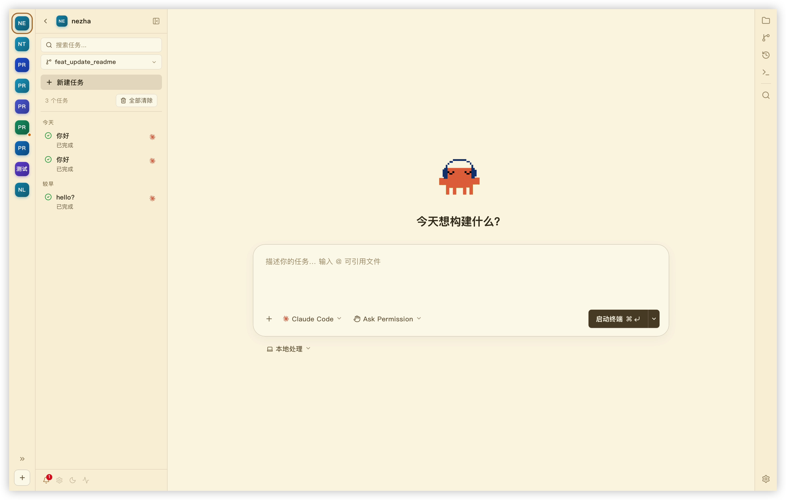

<p align="center">
  
</p>

<h1 align="center">哪吒(Nezha): 三头六臂，并发编程</h1>

<p align="center">
  专为 AI 编程量身打造的轻量级跨平台IDE 
</p>

<p align="center">
  多项目工作区, 快速切换多个项目下的 AI 会话 · 实时终端 · 会话自动发现 · 原生 Git 集成 · Git Worktree 支持 · 轻量级代码编辑器 · Skill 管理 
</p>
<p align="center">
  <a href="https://github.com/hanshuaikang/nezha/actions/workflows/checks.yml"></a>
  <a href="https://github.com/hanshuaikang/nezha/releases"></a>
  <a href="https://github.com/hanshuaikang/nezha/stargazers"></a>
</p>

<div align="center">
  <table>
    <tr>
      <td align="center">
        <a href="https://www.producthunt.com/products/nezha-2?embed=true&utm_source=badge-featured&utm_medium=badge&utm_campaign=badge-nezha" target="_blank" rel="noopener noreferrer">
          
        </a>
      </td>
      <td align="center">
        <a href="https://hellogithub.com/repository/hanshuaikang/nezha" target="_blank" rel="noopener noreferrer">
          
        </a>
      </td>
    </tr>
  </table>
</div>

<p align="center">
  
</p>

Nezha 是一款专为 AI 编程打造的跨平台轻量级 IDE。它把多项目管理、任务生命周期追踪、原生终端体验、Skill 管理、Git Worktree、会话回放、代码浏览和完整 Git 工作流整合到同一个界面里，让你不必在终端、编辑器、Git 工具和会话记录之间来回切换。只需要通过鼠标点击，就可以瞬间切换到不同的项目或任务。安装包只有 7M 大小。


[**English Documentation**](./README_EN.md)

## 为什么是 Nezha

传统的 IDE 和 VS Code 这样的编辑器本质上是以开发者为核心设计的，在古法编程时代，插件系统，重构，变量联想等诸多功能都是为了提升效率而设计的。而现在人写的代码越来越少, AI 写的代码越来越多，写代码本身开始变成一件可以并行的事情，这在以前是不敢想象的事情，但是人的注意力是有限的，如何快速跟踪多个项目的任务，就是哪吒想要解决的事情。

哪吒以 Agent 优先设计，内置终端直接集成原生 Claude Code 和 Codex。并在此之上集成 任务系统，Git, Git Worktree, 终端和代码编辑器。使得对于轻度需求无需打开笨重的 IDE 即可完成任务下发，代码 Review，代码提交等操作的闭环，而且不会打断你在其他项目进行中的工作。


## 安装 Nezha
在使用哪吒之前你需要先安装好 Claude Code / Codex, 初次安装会遇到"“NeZha”已损坏，无法打开。 你应该将它移到废纸篓。"。这是由于安装包未签名导致的，执行以下语句即可:

``` bash
xattr -rd com.apple.quarantine /Applications/nezha.app
```

## 核心功能
- 在单个应用内同时管理多个项目下多个 Claude Code 和 Codex 会话, 提升你的 5 倍编程效率，释放你的注意力。
- 自带通知提醒，当 Claude Code 和 Codex 需要人工介入时, 会自动弹出消息和应用角标提醒。
- 可视化会话，你可以直接在页面上可视化查看你和 Claude Code / Codex 每一次的会话详情，并随时 Resume 任务。
- 精选打磨的 UI 风格，内置白天, 黑夜 和 护眼模式。
- 原生集成 Git, 支持 AI 生成 Git Message, 同时底层支持 Git Worktree 的开发方式。
- 原生集成轻量级代码编辑器和 Markdown编辑器，支持所有常见编程语言代码高亮。
- 支持 Skill 管理, 你可以通过软链的方式集中管理你的所有本地 Skill


## 🌟 功能概览

### 🗂️ 多项目工作区

> **多项目工作区, 右侧侧边栏可以快速在多个项目间切换**

通过左侧的项目侧边栏,  你可以快速在多个工作区之间切换。

<p align="center">
  
  
</p>

### 📊 会话管理
在之前终端的会话一旦结束就只能 resume 才能看到，而在 Nezha 中, 会话结束之后会自动可视化会话内容, 方便你回顾，你还可以置顶重要的会话

<p align="center">
  
</p>


### 📝 内置代码编辑器与MarkDown编辑器

内置代码编辑器, 支持所有常见编程语言的语法高亮，Markdown 也支持预览。

<p align="center">
  
  
</p>

### 🌳 Git 集成

支持一键创建分支，AI 生成 Git Message, 支持 CodeReview 视图, 应用内直接集成 Git Worktree 的开发方式


<p align="center">
  
</p>

### 🎨 精心打磨的 UI 风格，支持白天和黑夜模式和护眼模式

<p align="center">
  
  
  
</p>

## 🙏 鸣谢

Nezha 的诞生离不开以下优秀的开源项目，向它们致敬：

- [Tauri](https://github.com/tauri-apps/tauri) - 构建更小、更快、更安全的桌面应用
- [React](https://github.com/facebook/react) - 构建用户界面的 JavaScript 库
- [xterm.js](https://github.com/xtermjs/xterm.js) - 强大的 Web 终端组件

感谢以下自媒体对本项目的关注和转发(以下排名不分先后), 大家感兴趣的话可以关注下他们 ～

| 平台 | 账号 |
| --- | --- |
| 推特 | [@aigclink](https://x.com/aigclink)、[@QingQ77](https://x.com/QingQ77)、[@ilovek8s](https://x.com/ilovek8s) |
| 公众号 | 码问 |


### 👬 友情链接
<a href="https://linux.do">Linux.do</a>
