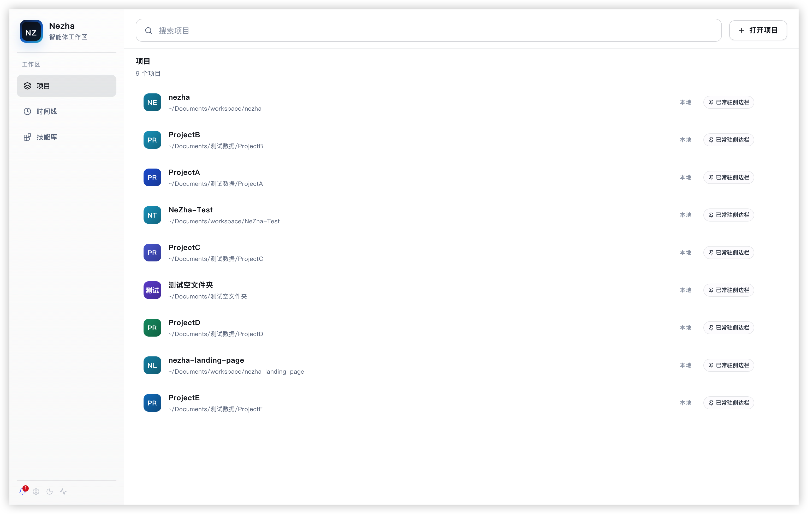
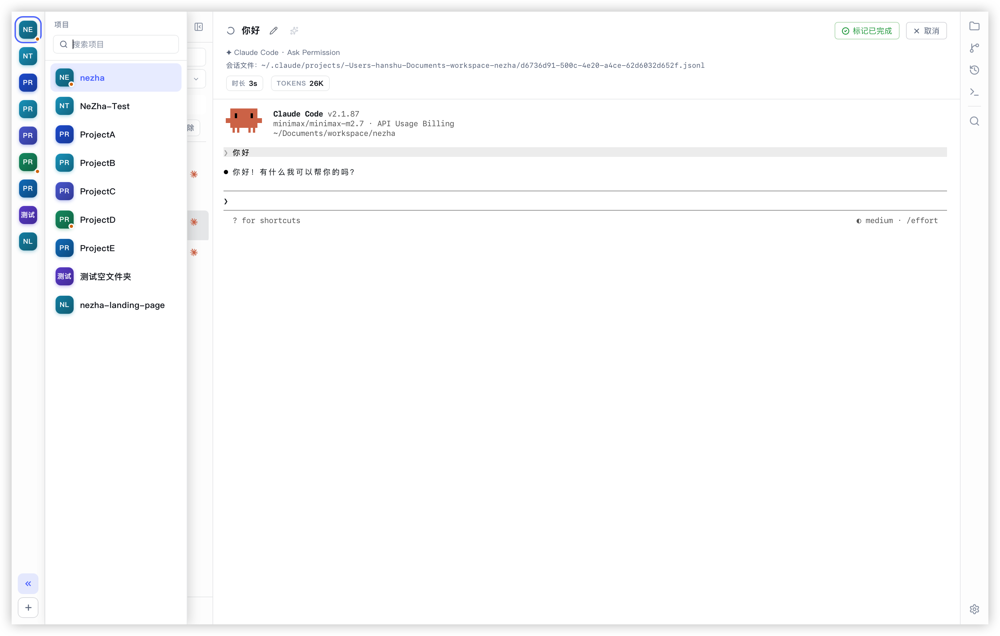
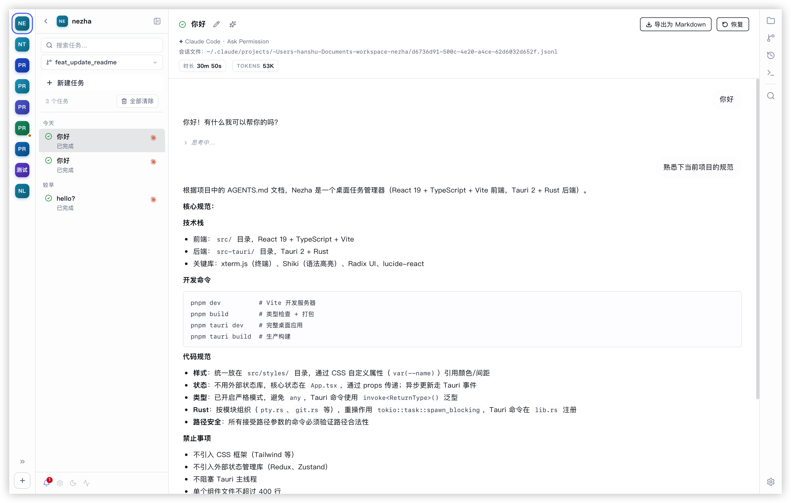
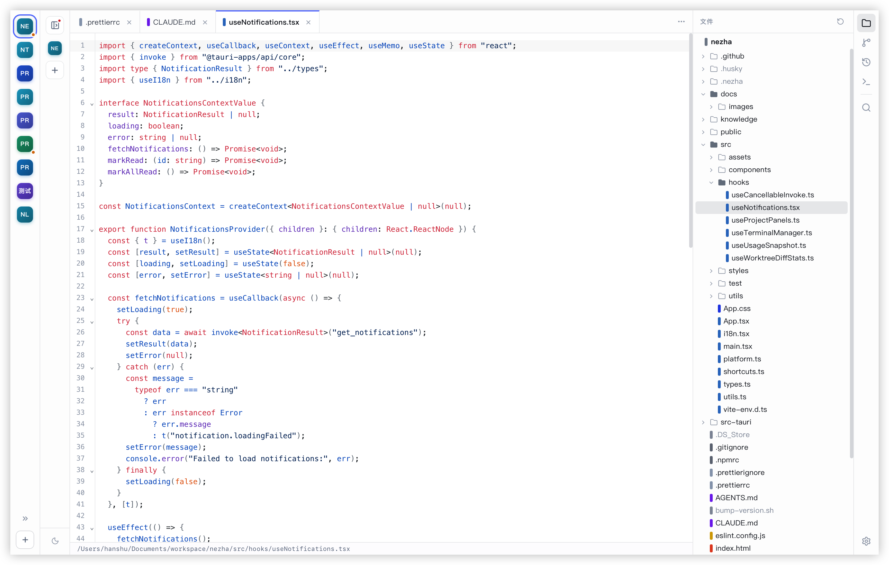
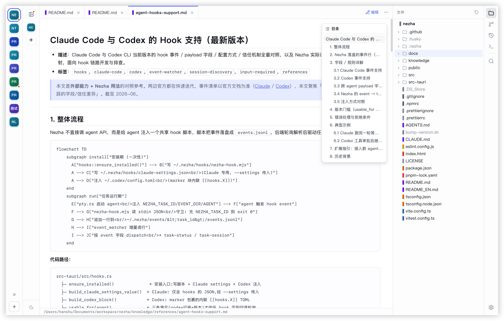
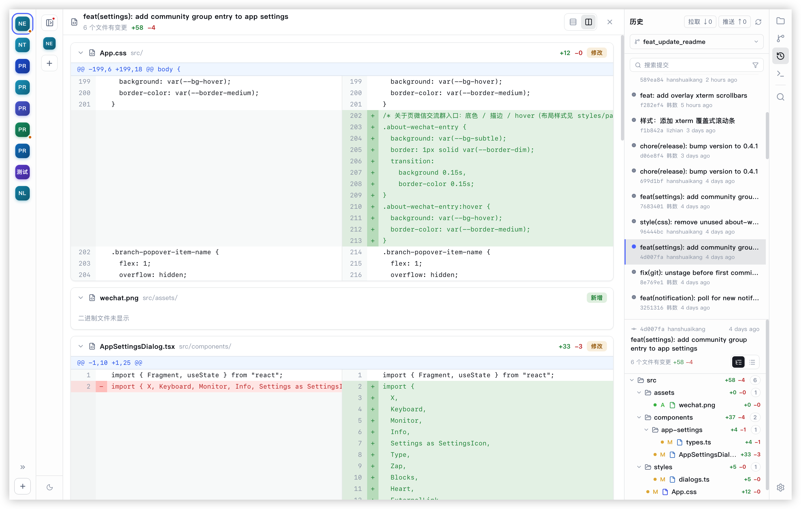
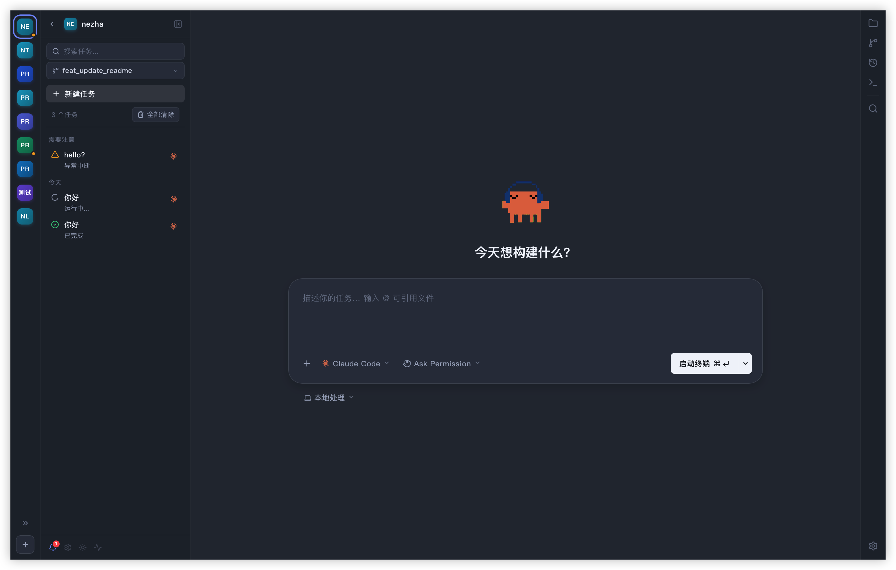
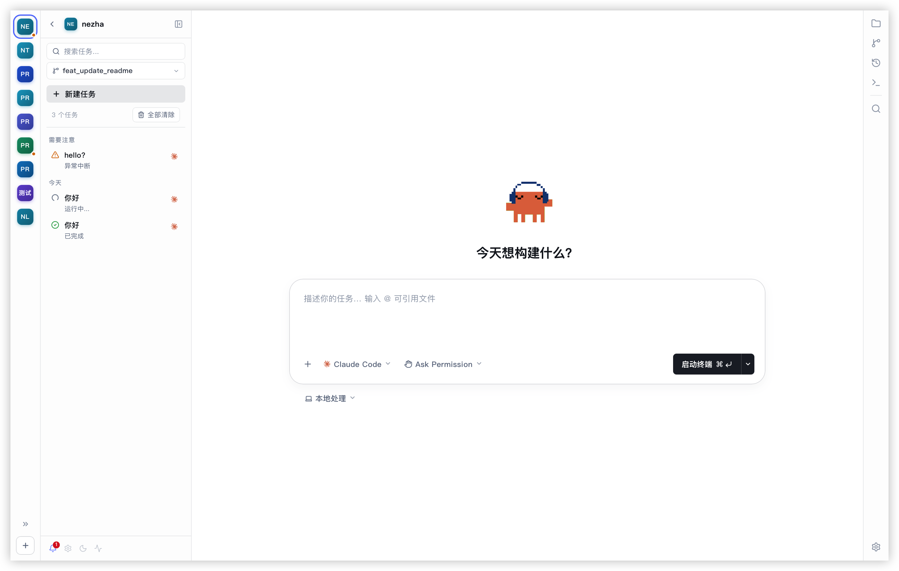

<p align="center">
  
</p>

<h1 align="center">Nezha: Three Heads, Six Arms — Programming in Parallel</h1>

<p align="center">
A lightweight cross-platform IDE purpose-built for AI coding.
</p>

<p align="center">
  Multi-Project Workspace · Fast Switching Between AI Sessions Across Projects · Real-time Terminal · Session Auto-discovery · Native Git Integration · Git Worktree Support · Lightweight Code Editor · Skill Management
</p>
<p align="center">
  <a href="https://github.com/hanshuaikang/nezha/actions/workflows/checks.yml"></a>
  <a href="https://github.com/hanshuaikang/nezha/releases"></a>
  <a href="https://github.com/hanshuaikang/nezha/stargazers"></a>
</p>

<div align="center">
  <table>
    <tr>
      <td align="center">
        <a href="https://www.producthunt.com/products/nezha-2?embed=true&utm_source=badge-featured&utm_medium=badge&utm_campaign=badge-nezha" target="_blank" rel="noopener noreferrer">
          
        </a>
      </td>
      <td align="center">
        <a href="https://hellogithub.com/repository/hanshuaikang/nezha" target="_blank" rel="noopener noreferrer">
          
        </a>
      </td>
    </tr>
  </table>
</div>

<p align="center">
  
</p>

Nezha is a lightweight cross-platform IDE purpose-built for AI coding. It brings multi-project management, task lifecycle tracking, a native terminal experience, session playback, code browsing, and a complete Git workflow into a single interface — so you no longer need to switch back and forth between the terminal, editor, Git client, and session logs. A few mouse clicks are all it takes to jump between projects or tasks. The installer is just 7MB.

[**中文文档 (Chinese Documentation)**](./README.md)

## Why Nezha?

Traditional IDEs and editors like VS Code are fundamentally built around the human developer. In the era of manual programming, features such as plugin ecosystems, refactoring tools, and variable autocomplete were all designed to boost individual productivity. But today, humans write less code while AI writes more. Coding itself is becoming inherently parallel — something that was unimaginable before. Human attention, however, remains limited. Quickly tracking tasks across multiple projects is precisely the problem Nezha sets out to solve.

Nezha is designed with an Agent-First philosophy. Its built-in terminal directly integrates native Claude Code and Codex, and on top of that it incorporates a task system, Git, Git Worktree, terminal, and code editor. For lighter workflows you no longer need to fire up a heavyweight IDE — you can close the loop on task dispatch, code review, and commits without interrupting your in-progress work on other projects.


## Installing Nezha

Before using Nezha, make sure Claude Code / Codex is already installed. On the first launch you may see *"“NeZha” is damaged and can’t be opened. You should move it to the Trash."* This is caused by the installer being unsigned. Resolve it with the following command:

``` bash
xattr -rd com.apple.quarantine /Applications/nezha.app
```

## Core Features
- Manage multiple Claude Code and Codex sessions across multiple projects inside a single application, boosting your coding throughput 5× and freeing up your attention.
- Built-in notifications: when Claude Code or Codex needs human intervention, system notifications and an app badge surface the prompt automatically.
- Visualized sessions: review the full details of every Claude Code / Codex session directly in the UI, and resume any task at any time.
- A carefully polished UI style with built-in light, dark, and eye-care modes.
- Native Git integration with AI-generated Git messages, with first-class support for Git Worktree workflows underneath.
- A built-in lightweight code editor and Markdown editor with syntax highlighting for every common programming language.
- Skill management: centrally manage all your local skills via symbolic links.


## 🌟 Feature Overview

### 🗂️ Multi-Project Workspace

> **Multi-project workspace — switch between projects in a single click via the right-hand sidebar.**

Use the left-hand project sidebar to instantly toggle between multiple workspaces.

<p align="center">
  
  
</p>

### 📊 Session Management

In a traditional terminal, a session disappears the moment it ends — the only way to revisit it is to resume. In Nezha, sessions are automatically visualized once they finish, making it easy to look back through them. You can also pin important sessions for quick access.

<p align="center">
  
</p>


### 📝 Built-in Code & Markdown Editors

A built-in code editor with syntax highlighting for every common programming language, alongside Markdown preview support.

<p align="center">
  
  
</p>

### 🌳 Git Integration

One-click branch creation, AI-generated Git messages, a dedicated code review view, and Git Worktree workflows integrated directly into the app.


<p align="center">
  
</p>

### 🎨 A Carefully Polished UI with Light, Dark, and Eye-Care Modes

<p align="center">
  
  
</p>

## 🙏 Acknowledgments

Nezha would not exist without the following outstanding open-source projects. Our deepest thanks to all of them:

- [Tauri](https://github.com/tauri-apps/tauri) — Build smaller, faster, and more secure desktop applications.
- [React](https://github.com/facebook/react) — The JavaScript library for building user interfaces.
- [xterm.js](https://github.com/xtermjs/xterm.js) — A powerful terminal component for the web.

Thanks to the following media creators for covering and sharing this project (in no particular order). Follow them if you're interested!

| Platform | Account |
| --- | --- |
| Twitter | [@aigclink](https://x.com/aigclink), [@QingQ77](https://x.com/QingQ77), [@ilovek8s](https://x.com/ilovek8s) |
| WeChat Official Account | 码问 |


### 👬 Friend Links
<a href="https://linux.do">Linux.do</a>
